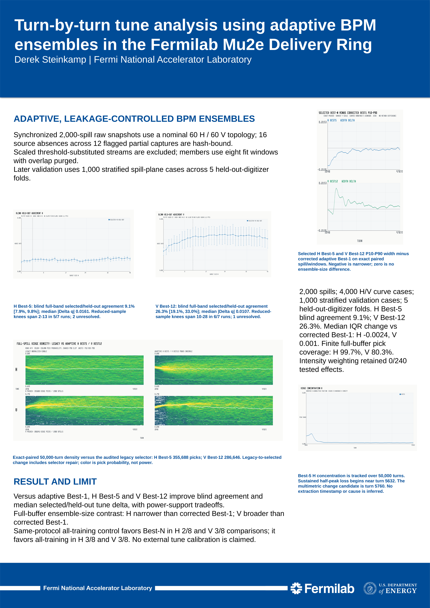

# tbt-monitor

`tbt-monitor` is research software for estimating transverse tune - the number
of horizontal or vertical beam oscillations per revolution - in the Fermilab
Mu2e Delivery Ring. It combines synchronized turn-by-turn samples from many
beam-position monitors (BPMs), where each sample records the beam position on
one circuit of the ring.

The project follows a simple rule: keep the raw readings and quality information
for each accelerator spill together before analyzing them. Incomplete captures
remain visible as warnings or quality flags instead of being silently
discarded.

<p align="center">
  <a href="publication/ibic2026/poster/build/ibic2026-abstract54-poster.pdf">
    
  </a>
</p>

<p align="center"><em>IBIC 2026 study overview - click the poster to open the full PDF.</em></p>

## Study result

The repository includes the finalized IBIC 2026 proceedings paper and the
approved, printed poster.

- [Proceedings paper WEP014 (PDF)](publication/ibic2026/paper/build/WEP014.pdf)
- [Poster (PDF)](publication/ibic2026/poster/build/ibic2026-abstract54-poster.pdf)
- [Editable poster (PPTX)](publication/ibic2026/poster/build/ibic2026-abstract54-poster.pptx)
- [Publication package and reproducibility notes](publication/ibic2026/README.md)

The study tested BPM choices on data that was not used to select them. Tune
observability was distributed around the ring rather than concentrated in one
permanently best BPM. Ensembles of five horizontal signals (H Best-5) and 12
vertical signals (V Best-12) were useful operating points: vertical agreement
was stronger across digitizers kept out of selection, while the horizontal
ensemble produced a narrower tune-candidate distribution than corrected
adaptive Best-1. Combining all available training channels remained a
competitive control.

These are internally repeatable **tune candidates**, not an absolute tune
calibration. A matched external reference or controlled quadrupole scan is
still required to establish absolute accuracy. See [Physics and claim
boundaries](docs/PHYSICS.md) for the full interpretation.

## What the software does

- **Monitor:** show which BPM channels are reporting and whether their readings
  belong to the same accelerator spill.
- **Capture:** write raw, inspectable spill bundles for offline analysis.
- **Analyze:** estimate horizontal and vertical tune candidates, follow their
  evolution through a spill, and compare adaptive BPM ensembles.

The main executable is named `tbt-monitor-tui` because its live monitor uses a
terminal interface. It covers live operation, capture, and routine offline
analysis. The Python tools provide the larger CPU/GPU studies, validation
controls, publication figures, and reproducibility checks.

## Quick start

The Rust application requires a toolchain with Rust 2024 edition support.

```bash
cargo build --locked
cargo run --locked -- --help
```

Create a runtime configuration from an ACNET XML export:

```bash
cargo run --locked -- import \
  --source /path/to/Config.xml \
  --output /path/to/monitor.cfg
```

Capture a small set of raw spills:

```bash
cargo run --locked -- capture-spills \
  --config /path/to/monitor.cfg \
  --out-dir out \
  --free-run \
  --count 25
```

Analyze those bundles without a live Redis connection:

```bash
cargo run --locked -- analyze-captured-spills \
  --config /path/to/monitor.cfg \
  --bundles-dir out \
  --out-dir out/offline_batch \
  --count 25
```

The checked-in `config/monitor.cfg` documents the Fermilab deployment and is
site-specific. Generate or copy a local configuration before operating against
another installation.

For the Python analysis stack, start with the CPU self-tests:

```bash
python3 scripts/gpu_analyze_captured_spills.py --self-test
python3 scripts/test_autosweep.py
python3 scripts/test_best_bpm_mining.py
```

NumPy and Matplotlib are required by the larger studies. SciPy can improve the
multitaper implementation, and CuPy enables the optional CUDA backend.

## Documentation

| Topic | Guide |
| --- | --- |
| Documentation index | [docs/README.md](docs/README.md) |
| Live monitoring and capture | [DAQ guide](docs/DAQ.md) |
| Rust analysis modes | [Analysis chains](docs/ANALYSIS_CHAINS.md) |
| Commands and configuration | [Usage](docs/USAGE.md), [config reference](docs/CONFIG_REFERENCE.md) |
| CPU/GPU research workflows | [Spark workflows](docs/SPARK.md) |
| Design and data contracts | [Architecture](docs/ARCHITECTURE.md), [design decisions](docs/DESIGN_DECISIONS.md) |
| Scientific interpretation | [Physics](docs/PHYSICS.md), [current status](docs/CURRENT_STATUS.md) |

## Repository layout

- `src/`: Rust CLI, TUI, capture, synchronization, and analysis paths.
- `scripts/`: CPU/GPU analysis, validation, figure, and publication tools.
- `config/`: runtime and Best-BPM analysis configuration examples.
- `docs/`: user, architecture, and scientific documentation.
- `publication/ibic2026/`: approved paper and poster sources, deliverables, and
  checksummed supporting material.

## Development

Run the standard Rust checks from the repository root:

```bash
cargo fmt --all -- --check
cargo test --locked -- --nocapture
```

Python validation entry points are listed in [docs/README.md](docs/README.md).
Changes should preserve the documented timing semantics, explicit incomplete
states, and output contracts. See [CONTRIBUTING.md](CONTRIBUTING.md) before
opening a pull request.

## Data availability

Raw accelerator captures are not distributed in this repository. They contain
site-specific operational data and require authorized Fermilab access. The
repository includes the software, derived publication results, canonical
figures, manifests, and final paper/poster artifacts needed to inspect the
published analysis boundary.

## Citation

Please cite IBIC 2026 paper WEP014, *Turn-by-turn tune analysis using adaptive
BPM ensembles in the Fermilab Mu2e Delivery Ring*, and identify the repository
revision used for software-derived results. Use the DOI from the proceedings
record when available.

## License

This project is distributed under the [BSD 3-Clause License](LICENSE).
